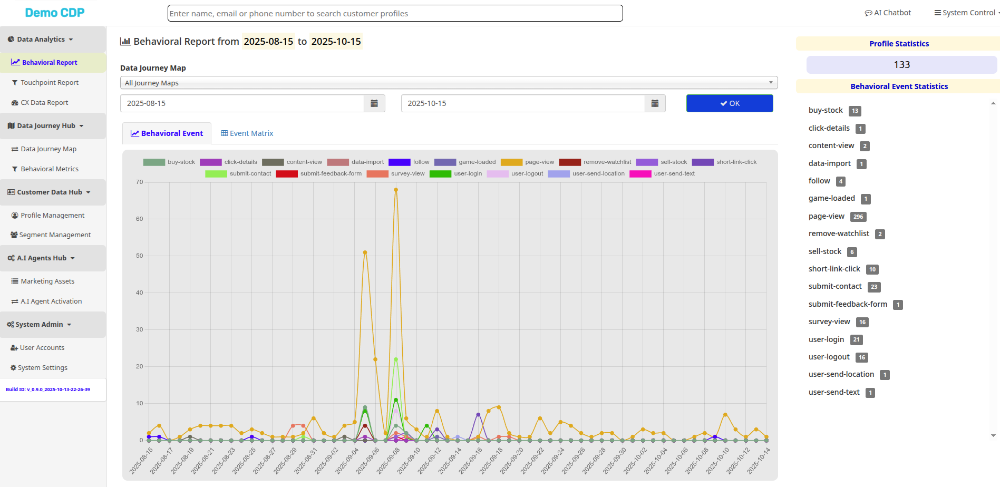
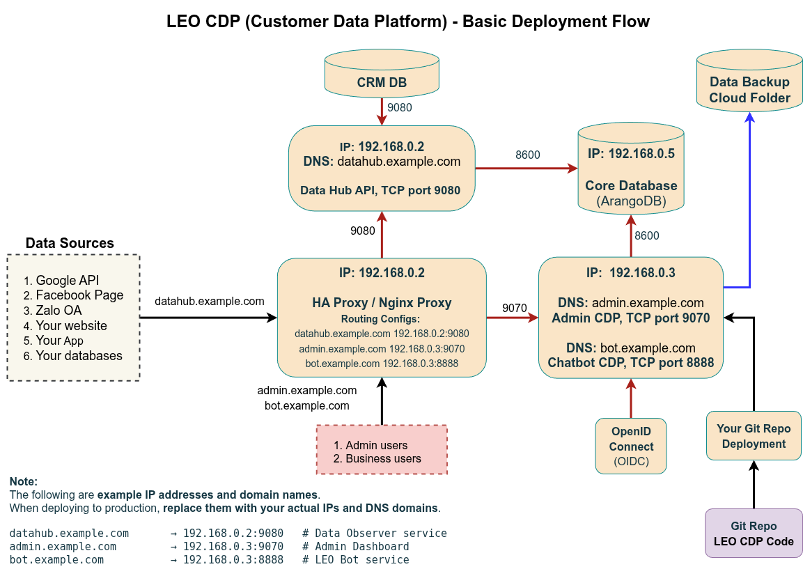

# LEO CDP Free Edition

**LEO Customer Data Platform (CDP)** – Free Edition repository.
This repository contains everything needed to run a local or production instance of LEO CDP, including configuration templates, setup scripts, JAR files, and supporting libraries.

---

## Table of Contents

1. [Overview](#overview)
2. [Repository Structure](#repository-structure)
3. [Prerequisites](#prerequisites)
4. [Configuration](#configuration)
5. [Setup Scripts](#setup-scripts)
6. [Running LEO CDP](#running-leo-cdp)
7. [Security Recommendations](#security-recommendations)
8. [License](#license)

---

## Overview



LEO CDP Free Edition provides a complete environment to manage customer data, including:

* Admin Dashboard for system management
* Data Hub for observer access
* LEO Bot for FAQs and content creation
* Database backup and retention management
* Messaging through Kafka or local queues
* Pre-packaged JAR files for core services and jobs

The repository supports **both local development** and **production deployment**.

---

## Repository Structure

```
.
├── configs/                         # Configuration templates and example metadata
├── deps/                            # Supporting libraries
├── devops-script/                   # Utility scripts for deployment and maintenance
├── airflow-dags/                    # Example Airflow DAGs
├── resources/                       # Supporting resources
├── public/                          # Frontend files and static content
├── static-data/                      # Example static datasets
├── *.jar                             # Pre-built JARs for LEO services:
│   ├── leo-main-starter-v_0.9.0.jar
│   ├── leo-data-processing-starter-v_0.9.0.jar
│   ├── leo-observer-starter-v_0.9.0.jar
│   └── leo-scheduler-starter-v_0.9.0.jar
├── *.sh                              # Setup and startup scripts
├── sample-leocdp-metadata.properties # Config template
├── leocdp-metadata.properties        # Generated production metadata
├── README.md                         # This file
└── NOTES-FOR-LOCAL-SETUP.md / NOTES-FOR-NEW-SETUP.md
```

---

## Basic Deployment Flow



This architecture illustrates the standard deployment flow for **LEO CDP**, showing how the system components interact across internal networks, APIs, and user interfaces.

The deployment typically involves **three main servers (or containers)** connected through secure TCP ports, fronted by an HAProxy or Nginx layer for routing and isolation.

### 🔹 Core Components

| Component                    | Description                                                                                                                        | Example Host / Port                        |
| ---------------------------- | ---------------------------------------------------------------------------------------------------------------------------------- | ------------------------------------------ |
| **Data Hub API**             | Collects and processes data from external sources such as Google, Facebook, Zalo, websites, and internal apps.                     | `datahub.example.com` → `192.168.0.2:9080` |
| **Admin CDP**                | The management dashboard for CDP administrators and business users. Handles analytics, campaign setup, and customer data policies. | `admin.example.com` → `192.168.0.3:9070`   |
| **LEO Bot Service**          | AI chatbot and content generation engine integrated with the Admin CDP for real-time engagement.                                   | `bot.example.com` → `192.168.0.3:8888`     |
| **Core Database (ArangoDB)** | The main data store for user profiles, events, and configurations.                                                                 | `192.168.0.5:8600`                         |
| **Data Backup Folder**       | Stores scheduled backups of the database for redundancy and recovery.                                                              | Cloud or mounted storage                   |

### 🔹 Networking & Routing

* All external and internal traffic passes through **HAProxy / Nginx Proxy**, which routes based on DNS names.
* Example routing configuration:

  ```
  datahub.example.com  → 192.168.0.2:9080
  admin.example.com    → 192.168.0.3:9070
  bot.example.com      → 192.168.0.3:8888
  ```

### 🔹 Authentication

* **OpenID Connect (OIDC)** handles authentication between Admin CDP, LEO Bot, and connected third-party systems.

### 🔹 Notes

> The above IPs and domains are **examples only**.
> Replace them with your **real IP addresses and DNS records** when deploying to production.

---

## Prerequisites

Before setting up **LEO CDP**, ensure the following requirements are met:

* **Operating System:** Linux environment (recommended: **Ubuntu 22.04 LTS**).
* **Java Runtime:** **Java 11 (Amazon Corretto or OpenJDK)** must be installed and available in your system path.
* **Shell Environment:** Scripts are written for **Bash** (`#!/bin/bash`).
* **Internet Access:** Required for fetching resources from CDNs and connecting to the optional **LEO Bot API**.

  * To deploy **LEO Bot**, refer to: [https://github.com/trieu/leo-bot](https://github.com/trieu/leo-bot)

---

## Configuration

1. **Template File:** `sample-leocdp-metadata.properties`
2. **Production Config:** `leocdp-metadata.properties` (generated via `setup-leocdp-metadata.sh`)

Key sections:

* **Admin Setup:** Superadmin email, admin dashboard and WebSocket domains, LEO Bot API
* **SMTP:** Mail server configuration
* **Database:** Default DB, backup path, period, retention
* **CDP Defaults:** Runtime environment, build version, profile merge strategy, data models, CDN

**Note:** The production metadata file is added to `.gitignore` automatically to avoid committing sensitive info.

---

## Setup Scripts

### 1. `setup-leocdp-metadata.sh`

Generates `leocdp-metadata.properties` from the template.

**Features:**

* Interactive prompts for all required fields
* Default values for backup periods and logo if left empty
* Automatically updates placeholders in template
* Adds generated file to `.gitignore`

**Usage:**

```bash
bash setup-leocdp-metadata.sh
```

---

### 2. `setup-leocdp-instance.sh` / `setup-leocdp-system.sh`

Initializes the CDP system:

* Prompts for superadmin password securely (masked input)
* Confirms password to prevent typos
* Runs system setup via the main JAR (`leo-main-starter-v_0.9.0.jar`)

**Usage:**

```bash
bash setup-leocdp-system.sh
```

---

### 3. Startup & Maintenance Scripts

| Script                         | Purpose                             |
| ------------------------------ | ----------------------------------- |
| `start-admin.sh`               | Start Admin Dashboard               |
| `start-observer.sh`            | Start Data Hub / Observer interface |
| `start-data-connector-jobs.sh` | Start data processing jobs          |
| `stop-server.sh`               | Stop all running LEO CDP services   |

---

## Running LEO CDP

1. Generate production metadata:

```bash
bash setup-leocdp-metadata.sh
```

2. Initialize system with superadmin credentials:

```bash
bash setup-leocdp-system.sh
```

3. Start core services:

```bash
bash start-admin.sh
bash start-observer.sh
bash start-data-connector-jobs.sh
```

4. Access Admin Dashboard at the domain configured in `leocdp-metadata.properties`.

---

## Security Recommendations

* Use **strong superadmin passwords**
* Keep `leocdp-metadata.properties` private and out of version control
* Enable TLS/SSL for all admin and API domains
* Rotate secrets regularly and backup your database
* Use secure SMTP credentials
